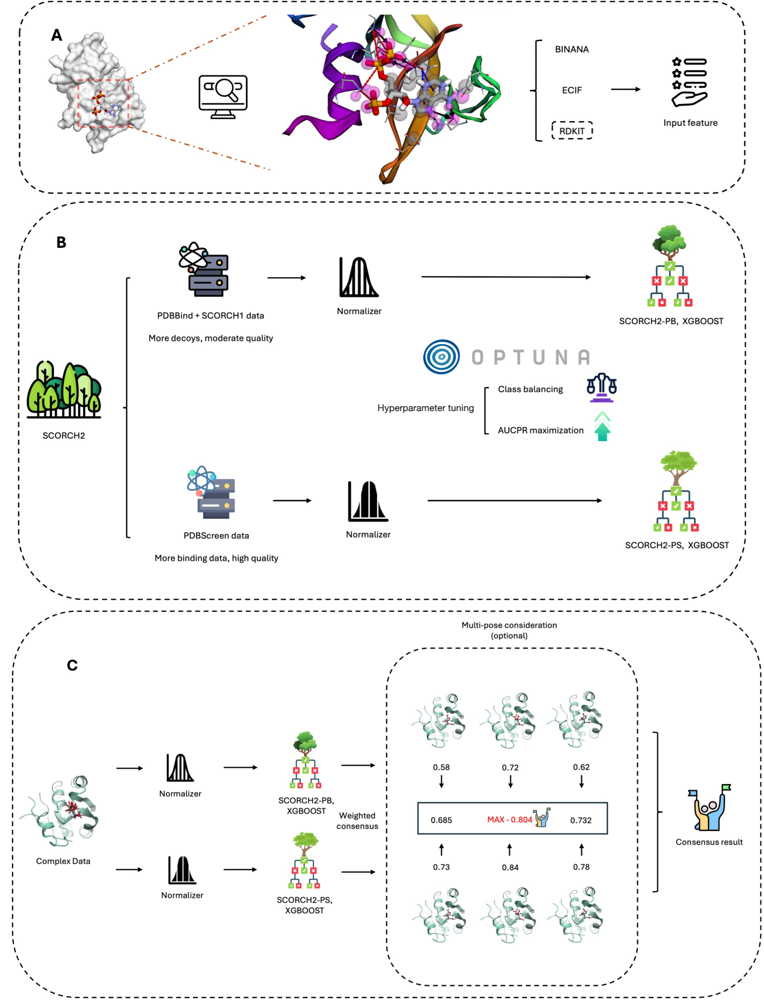

# SCORCH2

 [](https://github.com/dmlc/xgboost) [](https://www.python.org/)

## Overview

**SCORCH2 (SC2)** is a machine learning rescoring model designed for interaction-based virtual screening. Building upon the foundation of [SCORCH1](https://github.com/SMVDGroup/SCORCH/), SC2 employs two XGBoost models (SC2-PS and SC2-PB) that are trained with distinct datasets to capture local optimal knowledge patterns. Their predictions are combined through a weighted consensus approach to achieve superior active compound enrichment in virtual screening.

SCORCH2 offers three principal advantages:

1. **Superior Decision-Making**: Facilitates enhanced decision-making by focusing on key molecular interactions and fully interpretable features
2. **Streamlined Screening**: Eliminates the need for preliminary docking pose selection, streamlining the screening process
3. **Target-Agnostic Robustness**: The target-agnostic character provides robust performance on previously unseen protein targets

<div align="center">

</div>

## Installation

### Prerequisites

- Python 3.10 or higher
- Conda package manager
- [ADFRsuite](https://ccsb.scripps.edu/adfr/downloads/) (for PDBQT conversion)

### Environment Setup

```bash
# Clone the repository
git clone https://github.com/your-repo/SCORCH2.git
cd SCORCH2

# Create and activate conda environment
conda env create -f environment.yml
conda activate scorch2
```

## Quick Start

### Download Required Models

Before running SCORCH2, download the pre-trained models and scalers from [Zenodo](https://zenodo.org/records/14994007):

- `sc2_ps.xgb` - SC2-PS XGBoost model
- `sc2_pb.xgb` - SC2-PB XGBoost model  
- `sc2_ps_scaler` - Feature scaler for SC2-PS
- `sc2_pb_scaler` - Feature scaler for SC2-PB

### Demo with Example Data

For a quick demonstration using the provided example data and real models:

```bash
# Basic rescoring (all poses retained, no aggregation - default behavior)
python scorch2_rescoring.py \
    --protein-dir example_data/protein \
    --ligand-dir example_data/molecule \
    --sc2_ps_model /path/to/sc2_ps.xgb \
    --sc2_pb_model /path/to/sc2_pb.xgb \
    --ps_scaler /path/to/sc2_ps_scaler \
    --pb_scaler /path/to/sc2_pb_scaler \
    --output demo_results.csv \
    --gpu

# With pose aggregation (best pose selected per compound)
python scorch2_rescoring.py \
    --protein-dir example_data/protein \
    --ligand-dir example_data/molecule \
    --sc2_ps_model /path/to/sc2_ps.xgb \
    --sc2_pb_model /path/to/sc2_pb.xgb \
    --ps_scaler /path/to/sc2_ps_scaler \
    --pb_scaler /path/to/sc2_pb_scaler \
    --output demo_results_aggregated.csv \
    --aggregate --gpu
```

This streamlined command performs feature extraction, normalization, and rescoring in a single step.

## Usage

### Integrated Workflow

The `scorch2_rescoring.py` script provides two workflow options:

#### Option 1: Complete Workflow (From Structure Files)
Start with protein and ligand PDBQT files:

```bash
# Default: All poses retained (raw results)
python scorch2_rescoring.py \
    --protein-dir your_data/protein/ \
    --ligand-dir your_data/molecule/ \
    --sc2_ps_model models/sc2_ps.xgb \
    --sc2_pb_model models/sc2_pb.xgb \
    --ps_scaler models/sc2_ps_scaler \
    --pb_scaler models/sc2_pb_scaler \
    --output results.csv \
    --gpu

# Optional: Pose aggregation (best pose selected per compound)
python scorch2_rescoring.py \
    --protein-dir your_data/protein/ \
    --ligand-dir your_data/molecule/ \
    --sc2_ps_model models/sc2_ps.xgb \
    --sc2_pb_model models/sc2_pb.xgb \
    --ps_scaler models/sc2_ps_scaler \
    --pb_scaler models/sc2_pb_scaler \
    --output results_aggregated.csv \
    --aggregate --gpu
```

#### Option 2: From Pre-extracted Features
If you already have extracted features:

```bash
python scorch2_rescoring.py \
    --features your_features.csv \
    --sc2_ps_model models/sc2_ps.xgb \
    --sc2_pb_model models/sc2_pb.xgb \
    --ps_scaler models/sc2_ps_scaler \
    --pb_scaler models/sc2_pb_scaler \
    --output results.csv
```

### Required Data Structure

Ensure your data follows this structure:

```
your_data/
├── protein/
│   └── {pdb_id}_protein.pdbqt
└── molecule/
    └── {pdb_id}/
        └── {pdb_id}_XXX_pose*.pdbqt
```

### Output Formats

#### Raw Results (Default)
All poses are scored individually and ranked by SC2 score:
```csv
compound_id,sc2_ps_score,sc2_pb_score,sc2_score,rank
compound_pose1.pdbqt,0.85,0.92,0.87,1
compound_pose2.pdbqt,0.75,0.88,0.79,2
compound_pose3.pdbqt,0.65,0.82,0.70,3
```

#### Aggregated Results (--aggregate flag)
Best pose selected per compound with aggregation metadata:
```csv
compound_id,sc2_ps_score,sc2_pb_score,sc2_score,rank,selected_pose,total_poses
compound.pdbqt,0.85,0.92,0.87,1,pose1,3
```

## Data Preparation

### PDBQT Format Conversion

Convert your structures to PDBQT format with AutoDock charges (required for SCORCH2):

#### Protein Conversion
```bash
python utils/receptor_2_pdbqt.py \
    --source_dir /path/to/pdb_files \
    --output_dir /path/to/pdbqt_proteins \
    --n_proc X
```

#### Ligand Conversion
```bash
python utils/ligand_2_pdbqt.py \
    --input_dir /path/to/ligand_files \
    --output_dir /path/to/pdbqt_ligands \
    --input_format mol2 \
    --n_proc X
```

## Advanced Configuration

### Custom Consensus Weights
Adjust the weights for PS and PB model predictions:

```bash
python scorch2_rescoring.py \
    --protein-dir your_data/protein/ \
    --ligand-dir your_data/molecule/ \
    --sc2_ps_model models/sc2_ps.xgb \
    --sc2_pb_model models/sc2_pb.xgb \
    --ps_scaler models/sc2_ps_scaler \
    --pb_scaler models/sc2_pb_scaler \
    --output results.csv \
    --ps_weight 0.8 \
    --pb_weight 0.2
```

### Temporary File Management
Preserve intermediate files for inspection:

```bash
python scorch2_rescoring.py \
    --protein-dir your_data/protein/ \
    --ligand-dir your_data/molecule/ \
    --sc2_ps_model models/sc2_ps.xgb \
    --sc2_pb_model models/sc2_pb.xgb \
    --ps_scaler models/sc2_ps_scaler \
    --pb_scaler models/sc2_pb_scaler \
    --output results.csv \
    --keep-temp \
    --temp-dir my_temp_files
```

## Model Interpretation with SHAP

SCORCH2 includes a comprehensive SHAP (SHapley Additive exPlanations) analysis tool for model interpretation, helping to understand which molecular features contribute most to predictions for specific compounds.

### SHAP Analysis Features

- 🔍 **Feature Importance Ranking**: Rank all features by their contribution to model predictions
- 📊 **Waterfall Plots**: Visualize individual compound predictions and feature contributions
- 🎯 **Compound-Specific Analysis**: Analyze specific compounds by ID
- 💾 **Export Results**: Save rankings and plots for further analysis

### Usage Examples

#### Analyze a Specific Compound
```bash
python shap_explanation.py \
    --model models/sc2_pb.xgb \
    --data normalized_features/your_data.csv \
    --compound CHEMBL123456 \
    --output-dir shap_results/
```

#### Generate Feature Importance Ranking
```bash
python shap_explanation.py \
    --model models/sc2_ps.xgb \
    --data normalized_features/your_data.csv \
    --ranking-only \
    --output-dir shap_results/
```

#### Batch Analysis with Custom Parameters
```bash
python shap_explanation.py \
    --model models/sc2_pb.xgb \
    --data normalized_features/your_data.csv \
    --max-display 30 \
    --output-dir shap_results/ \
    --no-gpu
```

### SHAP Output Files

The SHAP analysis generates several output files:

- **`shap_feature_ranking.csv`**: Features ranked by importance with SHAP values
- **`shap_waterfall_{compound_id}.png`**: Waterfall plots showing feature contributions
- **Console output**: Top 10 most important features and analysis summary

### Result Interpretation

- **Positive SHAP values**: Features that increase the binding probability
- **Negative SHAP values**: Features that decrease the binding probability  
- **Feature magnitude**: Larger absolute values indicate stronger contributions
- **Baseline**: The average model prediction across the dataset

### Integration with Rescoring Workflow

The SHAP analysis tool integrates seamlessly with SCORCH2 rescoring results:

```bash
# 1. Perform rescoring
python scorch2_rescoring.py \
    --protein-dir your_data/protein/ \
    --ligand-dir your_data/molecule/ \
    --sc2_ps_model models/sc2_ps.xgb \
    --sc2_pb_model models/sc2_pb.xgb \
    --ps_scaler models/sc2_ps_scaler \
    --pb_scaler models/sc2_pb_scaler \
    --output rescoring_results.csv

# 2. Identify top-ranked compounds from results
# Extract compound IDs with highest SC2 scores

# 3. Analyze top compounds with SHAP
python shap_explanation.py \
    --model models/sc2_pb.xgb \
    --data your_features.csv \
    --compound TOP_COMPOUND_ID \
    --output-dir interpretation_results/

# 4. Compare feature contributions across different compounds
```

## Benchmarking and Evaluation

### Reproducing Benchmark Results

Download pre-computed features and models from [Zenodo](https://zenodo.org/records/14994007), then run:

#### DEKOIS 2.0 Evaluation
```bash
python evaluation/sc2_evaluation.py vs \
    --sc2_ps models/sc2_ps.xgb \
    --sc2_pb models/sc2_pb.xgb \
    --sc2_ps_feature_repo evaluation_features/dekois/sc2_ps/XXX \
    --sc2_pb_feature_repo evaluation_features/dekois/sc2_pb/XXX \
    --keyword active \
    --aggregate \
    --gpu \
    --output results/dekois_results.csv
```

#### VSDS-vd Evaluation
```bash
python evaluation/sc2_evaluation.py vs \
    --sc2_ps models/sc2_ps.xgb \
    --sc2_pb models/sc2_pb.xgb \
    --sc2_ps_feature_repo evaluation_features/vsds/sc2_ps_flare_vsds \
    --sc2_pb_feature_repo evaluation_features/vsds/sc2_pb_flare_vsds \
     --keyword inactive \
    --aggregate \
    --gpu \
    --output results/vsds_results.csv
```

#### DUD-E Evaluation
```bash
python evaluation/sc2_evaluation.py vs \
    --sc2_ps models/sc2_ps.xgb \
    --sc2_pb models/sc2_pb.xgb \
    --sc2_ps_feature_repo evaluation_features/dude/sc2_ps_equiscore_dude \
    --sc2_pb_feature_repo evaluation_features/dude/sc2_pb_equiscore_dude \
    --keyword active \
    --output results/dude_results.csv
```

**Note**: DUD-E and part of DEKOIS 2.0 (Vina,Gold,Surflex and Ledock poses) evaluations do not support result aggregation (multi-pose consideration) since only one pose per compound is available.

#### Compound Ranking
```bash
python evaluation/sc2_evaluation.py ranking \
    --sc2_ps models/sc2_ps.xgb \
    --sc2_pb models/sc2_pb.xgb \
    --sc2_ps_feature_repo evaluation_features/merck/sc2_ps_normalized \
    --sc2_pb_feature_repo evaluation_features/merck/sc2_pb_normalized \
    --exp_repo experimental_data/ \
    --gpu \
    --output results/ranking_results.csv
```

### Performance Metrics

SCORCH2 is evaluated using standard metrics:

- **Virtual Screening**: Enrichment Factors (EF 0.5%, 1%, 2%, 5%), BEDROC, AUC-ROC, AUC-PR
- **Binding Affinity Ranking**: Pearson, Spearman, and Kendall correlation coefficients


## Data Sources and Benchmarks

- **PDBScreen**: Derived from [EquiScore](https://github.com/CAODH/EquiScore) ([Zenodo Link](https://zenodo.org/records/8049380))
- **SCORCH1 Data**: From the [original SCORCH repository](https://github.com/SMVDGroup/SCORCH/)
- **PDBBind**: Available at [PDBBind Plus](https://www.pdbbind-plus.org.cn)

## Troubleshooting

### Common Issues

1. **Missing Dependencies**: Ensure ADFRsuite is properly installed and in PATH
2. **Memory Errors**: Reduce the number of parallel processes with `--num-cores`
3. **GPU Issues**: Verify CUDA installation or remove `--gpu` flag
4. **File Not Found**: Check data structure matches requirements

### Performance Optimization Tips

- Use `--gpu` flag for faster inference on CUDA-compatible devices
- Adjust `--num-cores` based on available CPU cores
- Ensure sufficient disk space for temporary files

## Support and Issues

- 📧 **Contact**: lin.chen@ed.ac.uk
- 🐛 **Issues**: [GitHub Issues](https://github.com/LinCompbio/SCORCH2/issues)

## Citation

If SCORCH2 contributes to your research, please cite:

```bibtex
@article{Chen2025.03.31.646332,
    title={SCORCH2: a generalised heterogeneous consensus model for high-enrichment interaction-based virtual screening},
    author={Chen, Lin and Blay, Vincent and Ballester, Pedro J. and Houston, Douglas R.},
    journal={bioRxiv},
    year={2025},
    doi={10.1101/2025.03.31.646332},
    publisher={Cold Spring Harbor Laboratory}
}

@article{mcgibbon2023scorch,
    title={SCORCH: Improving structure-based virtual screening with machine learning classifiers, data augmentation, and uncertainty estimation},
    author={McGibbon, Miles and Money-Kyrle, Sam and Blay, Vincent and Houston, Douglas R},
    journal={Journal of Advanced Research},
    volume={46},
    pages={135--147},
    year={2023},
    publisher={Elsevier}
}
```
