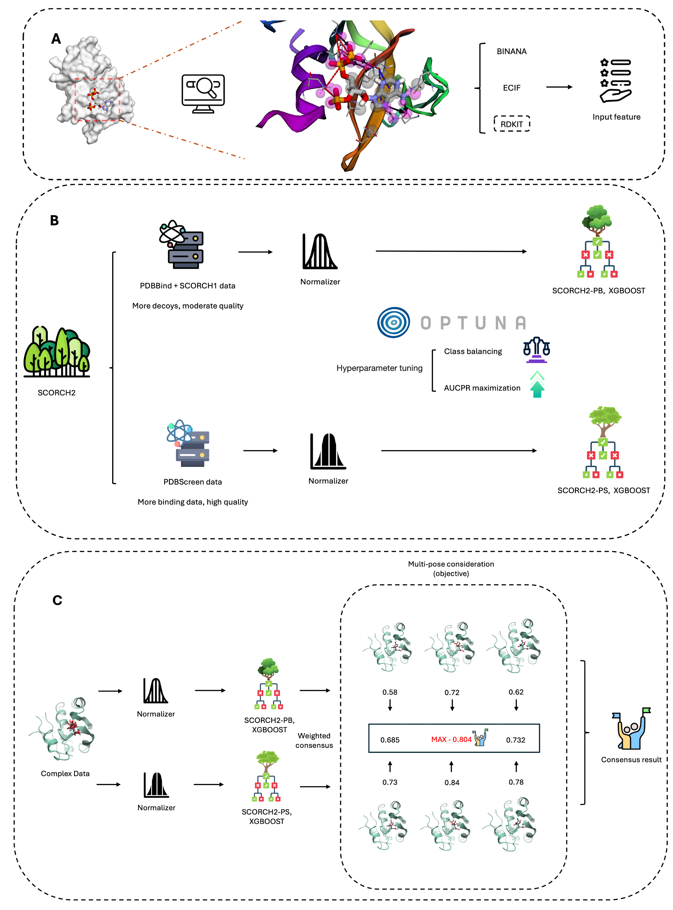

  # SCORCH2

 [](https://github.com/dmlc/xgboost)

## Introduction

SCORCH2 (SC2) is a consensus docking pose rescoring ML model for interaction-based virtual screening. SC2 is a continual work build upon SC1 (https://github.com/SMVDGroup/SCORCH/), where two XGBoost models are curated and trained separately to derive optimal knowledge pattern and then merge their result together for top-tier actives enrichment. 

<div style="text-align: center;">
  
</div>

## Dataset
PDBScreen data is derived from [Equiscore](https://github.com/CAODH/EquiScore?tab=readme-ov-file) and can be accessed from: [Zenodo](https://zenodo.org/records/8049380).

SCORCH1 data is from https://github.com/SMVDGroup/SCORCH/

PDBBind data is from https://www.pdbbind-plus.org.cn

## Running

### Reproduce the result on common benchmarks

Download the prepared features (DUD-E, DEKOIS, VSDS-VD), and model weight for two XGBoost models from zenodo: XXX. Unzip the files to the root repository. Then run script below:

<pre>
python3 sc2_evaluation.py --sc2_ps path-to-sc2_ps.pkl --sc2_pb path-to-sc2_pb.pkl  --sc2_ps_feature_repo path-to-sc2_ps-feature --sc2_ps_feature_repo path-to-sc2_ps-feature --aggregate --keyword active
</pre>

For example, to get the result on DEKOIS 2.0 dataset, Glide SP docking poses:
<pre>
python3 sc2_evaluation.py --sc2_ps sc2_ps.pkl --sc2_pb sc2_pb.pkl  --sc2_ps_feature_repo evaluation_feature/dekois/sc2_ps/sc2_ps_equiscore_glide --sc2_ps_feature_repo evaluation_feature/dekois/sc2_pb/sc2_pb_equiscore_glide 
--aggregate --keyword active
</pre>

Features from different docking methods are integrated inside and simply change the child path like this to get SC2 result on Flare docking poses :
<pre>
--sc2_ps_feature_repo evaluation_feature/dekois/sc2_ps/sc2_pb_flare --sc2_ps_feature_repo evaluation_feature/dekois/sc2_pb/sc2_pb_flare
</pre>

DUDE 
<pre>
python3 sc2_evaluation.py --sc2_ps sc2_ps.pkl --sc2_pb sc2_pb.pkl  --sc2_ps_feature_repo evaluation_feature/dude/sc2_ps_equiscore_dude --sc2_pb_feature_repo evaluation_feature/dude/sc2_pb_equiscore_dude 
--keyword active
</pre>
without --aggregate since only one pose is available

VSDS-VD
<pre>
python3 sc2_evaluation.py --sc2_ps sc2_ps.pkl --sc2_pb sc2_pb.pkl  --sc2_ps_feature_repo evaluation_feature/vsds/sc2_ps_flare_vsds --sc2_pb_feature_repo evaluation_feature/vsds/sc2_pb_flare_vsds 
--aggregate --keyword inactive
</pre>


## 📖 Citation

If you think our work helps, please consider citing the following papers 👇 :

```bibtex
@article{mcgibbon2023scorch,
  title={SCORCH: Improving structure-based virtual screening with machine learning classifiers, data augmentation, and uncertainty estimation},
  author={McGibbon, Miles and Money-Kyrle, Sam and Blay, Vincent and Houston, Douglas R},
  journal={Journal of Advanced Research},
  volume={46},
  pages={135--147},
  year={2023},
  publisher={Elsevier}
}

@article{lin2025scorch2,
  title={SCORCH2: advancing generalized interaction-based virtual screening from model consensus with different knowledge pattern},
  author={McGibbon, Miles and Money-Kyrle, Sam and Blay, Vincent and Houston, Douglas R},
  journal={Journal of Advanced Research},
  volume={46},
  pages={135--147},
  year={2023},
  publisher={Elsevier}
}


